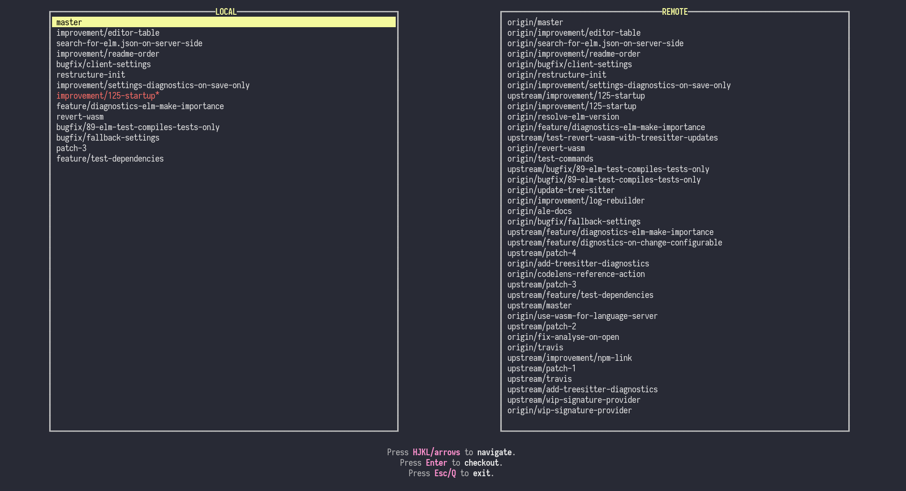

# git-brunch

A git checkout command-line tool



## Install from source

```sh
git clone https://github.com/andys8/git-brunch.git
cd git-brunch
stack install
```

## Usage

Run `git-brunch` or `git brunch`.
